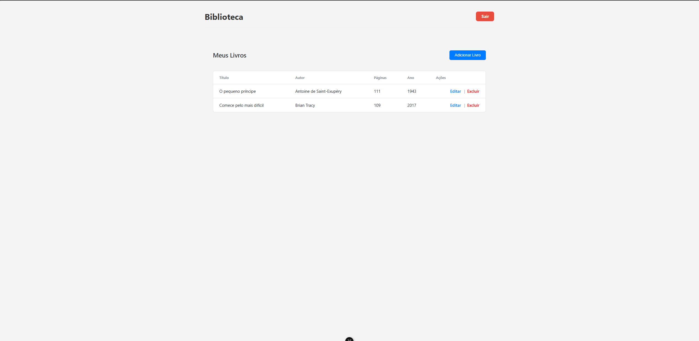

# Cadastro de Livros - Frontend

Este é o **frontend** do sistema de Cadastro de Livros, desenvolvido em **Vue 3 com TypeScript**, que consome uma API backend e utiliza o **Supabase** para autenticação.

## Tecnologias Utilizadas

- **Vue 3** → Framework principal para construção da interface.
- **TypeScript** → Tipagem estática para maior segurança no desenvolvimento.
- **Vue Router** → Gerenciamento de rotas e navegação entre páginas.
- **Axios** → Consumo da API backend.
- **Supabase** → Autenticação de usuários e gerenciamento de sessão.
- **ESLint + Prettier** → Padronização e qualidade de código.

## Autenticação

- O projeto utiliza o **Supabase Auth** para login e gerenciamento de sessão.
- As requisições HTTP feitas pelo Axios incluem automaticamente o **token JWT** do usuário autenticado.

## API Backend

Este projeto consome uma API backend para realizar operações de CRUD (Criar, Ler, Atualizar e Excluir) relacionadas aos livros. A API está configurada para gerenciar os dados de forma eficiente e segura.

ndpoints Principais

- GET /api/books: Retorna a lista de livros cadastrados.
- POST /api/books: Adiciona um novo livro.
- PUT /api/books/:id: Atualiza os dados de um livro existente.
- DELETE /api/books/:id: Exclui um livro pelo ID.

### Configuração da API

Certifique-se de que o backend está rodando na URL correta. Por padrão, o frontend está configurado para acessar o backend em http://localhost:3000. Caso utilize outra URL, atualize as chamadas na configuração do Axios.

### Link para o Backend

O código-fonte do backend pode ser encontrado no seguinte repositório:
[Backend](https://github.com/anny-nl/SD-Projeto_livros)

## Estrutura do Projeto

Abaixo está a estrutura de pastas e arquivos do projeto:

```
cadastro-livros-frontend/
├── src/
│   ├── assets/                # Arquivos estáticos (imagens, ícones, etc.)
│   ├── components/            # Componentes Vue reutilizáveis
│   │   ├── BooksManager.vue   # Gerenciamento de livros (CRUD)
│   ├── composables/           # Funções reutilizáveis (ex.: autenticação)
│   │   ├── useAuth.ts         # Lógica de autenticação com Supabase
│   ├── lib/                   # Configurações externas
│   │   ├── supabaseClient.ts  # Cliente Supabase configurado
│   ├── views/                 # Páginas principais
│   │   ├── HomeView.vue       # Página inicial com lista de livros
│   ├── types/                 # Tipos TypeScript usados no projeto
│   ├── env.d.ts               # Configuração de variáveis de ambiente
│   ├── App.vue                # Componente raiz do Vue
│   ├── main.ts                # Arquivo principal para inicialização do Vue
├── public/                    # Arquivos públicos (ex.: index.html)
├── README.md                  # Documentação do projeto
├── package.json               # Dependências e scripts do projeto
├── tsconfig.json              # Configuração do TypeScript
├── tsconfig.app.json          # Configuração específica para o aplicativo
├── vite.config.ts             # Configuração do Vite
```

## Configuração do Projeto

### Instalar Dependências

```sh
npm install
```

### Executar em Ambiente de Desenvolvimento

```sh
npm run dev
```

### Gerar Build para Produção

```sh
npm run build
```

### Verificar e Corrigir Código com ESLint

```sh
npm run lint
```

## Funcionalidades

- **Autenticação**: Login e cadastro de usuários com Supabase.
- **Gerenciamento de Livros**: Adicionar, editar, listar e excluir livros.
- **Interface Responsiva**: Adaptada para diferentes tamanhos de tela.

## Screenshots da Aplicação

### Tela de Login


### Tela de Cadastro


### Tela Inicial



### Modal de Adicionar Livro


### Modal de Editar Livro


